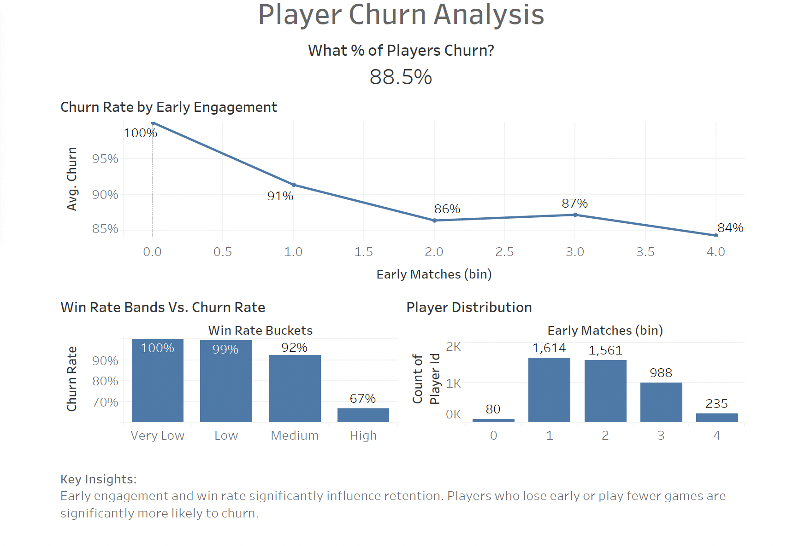

# Player Behaviour & Retention Analysis (Game Analytics Project)

This project simulates a real-world game analytics workflow, analysing player behaviour, matchmaking outcomes, and retention dynamics in a multiplayer environment.

It is designed to reflect the type of analytical work carried out on live-service games, combining statistical modelling, machine learning, SQL-based data pipelines, and data visualisation to generate actionable insights.

## Goals

- Investigate how early gameplay experience influences long-term player retention.
- Demonstrate how data can be used to inform product and design decisions in a gaming context.

## Key Insights

- Early player behaviour is the strongest predictor of retention  
- Players with **low early engagement** are significantly more likely to churn  
- Players with **low win rates** in early matches have elevated churn risk  
- Matchmaking quality and onboarding experience are critical to long-term engagement  

## Data Simulation

A synthetic dataset was generated to replicate realistic player behaviour:

- Player activity is simulated **day-by-day using probabilistic modelling**
- Churn is modelled as a function of:
  - Early engagement  
  - Early win rate  
- Produces a realistic churn distribution (~30–60%)  
- Captures non-linear behavioural patterns seen in real game telemetry  

This approach enables analysis of player lifecycle dynamics without relying on external data.

## Feature Engineering (SQL Pipeline)

Raw event-level data is transformed into modelling-ready features using SQL:

- Aggregation of player activity (matches, win rate)  
- Early lifecycle metrics (first 3 days)  
- Behavioural indicators linked to retention  
- Churn labels based on inactivity windows  

Example:

    CREATE VIEW player_summary AS
    SELECT
        player_id,
        COUNT(*) AS total_matches,
        AVG(win) AS win_rate
    FROM matches
    GROUP BY player_id;

## Machine Learning

A churn prediction model was developed using:

- Gradient Boosting Classifier  
- Behavioural features derived from early gameplay  

The model highlights that:

- Early engagement metrics have strong predictive power  
- Retention is influenced by a combination of performance and activity  

## Data Visualisation

### Dashboard


### Dashboard Highlights

- **Churn Rate by Early Engagement**  
  Clear inverse relationship between early activity and churn  

- **Win Rate Bands vs Churn Rate**  
  Lower win rates correlate with increased player drop-off  


- **Player Distribution**  
  Reveals concentration of players in low-activity segments  

## Tools Used

- Python (pandas, numpy, scikit-learn)  
- SQL (SQLite)  
- Tableau  
- Visual Studio Code  

## Project Structure

```
game-matchmaking-analysis/

├── data/              # Simulated dataset  
├── notebooks/         # Data generation, analysis, and modelling  
├── sql/               # Feature engineering pipeline  
├── outputs/           # Dashboard and insights  
└── README.md  
```
## Project Outcome

This project demonstrates:

- Application of statistical theory to player behaviour modelling  
- Use of machine learning for retention prediction  
- Strong SQL skills for transforming large behavioural datasets  
- Ability to translate data into actionable product insights  
- Understanding of player engagement dynamics in multiplayer games  